# Repo: Análise de Sentimentos com Language Studio no Azure AI
### Objetivo

Repositório criado para entregar o projeto final da etapa: Análise de Sentimentos com Language Studio no Azure AI.

Mostrarei detalhes de duas abordagens:

- Azure AI Speech Studio
- Azure AI Language Studio

# Requerimentos do projeto
### Como Entregar esse projeto?

Chegou a hora de você construir um portfólio ainda mais rico e impressionar futuros recrutadores, para isso é sempre importante mostrar os resultados do seu esforço e como você os obteve deixando claro o seu racional, para isso faça da seguinte maneira:

1. Crie um novo repositório no github com um nome a sua preferência
2. Crie uma pasta chamada 'inputs' e crie um documento de texto com algumas sentenças
3. Crie um arquivo chamado readme.md , deixe alguns prints descreva o processo, alguns insights e possibilidades que você aprendeu durante o conteúdo após a IA analisar suas sentenças
4. Compartilhe conosco o link desse repositório através do botão 'entregar projeto'

# Links úteis

1. https://aka.ms/ai900-speech
2. https://aka.ms/ai900-text-analysis

# Crie um arquivo chamado readme.md , deixe alguns prints descreva o processo, alguns insights e possibilidades que você aprendeu durante o conteúdo após a IA analisar suas sentenças.

O serviço **Azure AI Speech** transcreve a fala em texto e o texto em fala audível. 

Exemplos práticos:

* Transcrever notas de reuniões.
* Gerar texto a partir da gravação de entrevistas.

#### Insights e possibilidades

Baseado no [outro exercício](https://github.com/flaviocmb/Repo-Reconhecimento-Facial-e-transforma-o-de-imagens-em-Dados-no-Azure-ML) onde falei sobre a possibilidade de monitorar os pets em casa, aqui o conceito é utilizar um recurso bidirecional de áudio (ouvir e falar) por meio de um dispositivo de monitoramento inteligente projetado para ajudar os proprietários de pets ou pessoas enfermas ou outros cuidados, permitindo estarem conectados quando estão longe de casa.

A transcrição dos áudios será feita para detectar palavras e acionar alertas a partir dessas transcrições.

#### O processo - Azure AI Speech Studio

Há duas maneiras apresentadas para criar um serviço de fala:

- Criar um recurso Speech.
- Criar um recurso Azure AI services.

Crie um recurso Speech diretamente no [**Azure AI Speech Studio**](https://speech.microsoft.com) como apresentado no primeiro link útil para ter acesso ao **Try out Real-time speech to text** que vamos utilizar para a transcrição.

### Try out Real-time speech to text

Na plataforma é possível incluir um arquivo de áudio ou gravar diretamente pelo navegador.

Realizei dois testes com um microfone ruim e um bom. Os dois casos foram transcritos com perfeição. 

⚠️ Os arquivos estão disponíveis na pasta **inputs** ⚠️

Um detalhe chamou a atenção que foi a pausa entre as palavras que geraram um ponto final entre as frases no áudio bom e no áudio ruim uma vírgula.

| Áudio Bom | Áudio Ruim |
|:--------:|:--------:|
|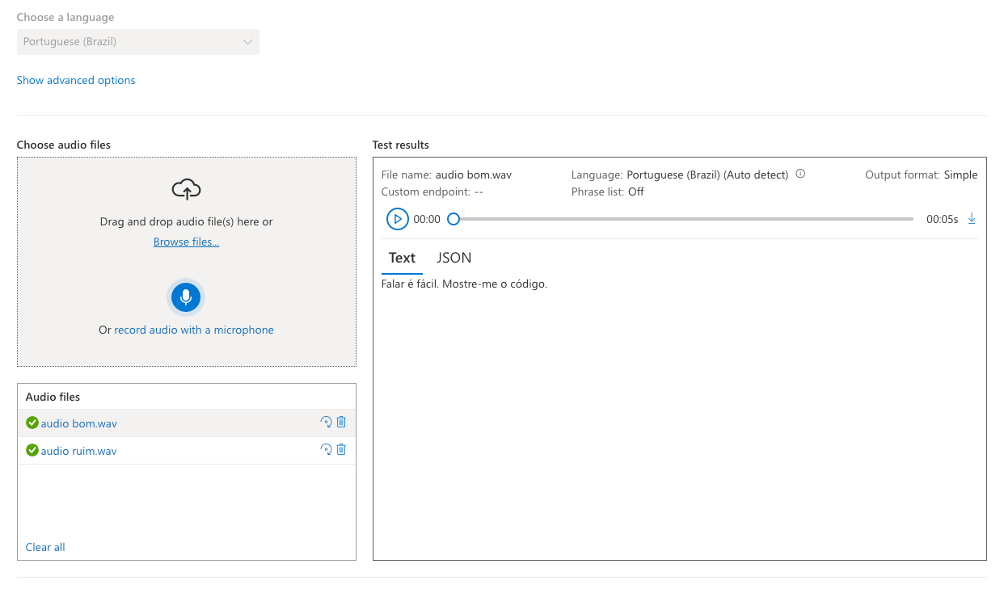|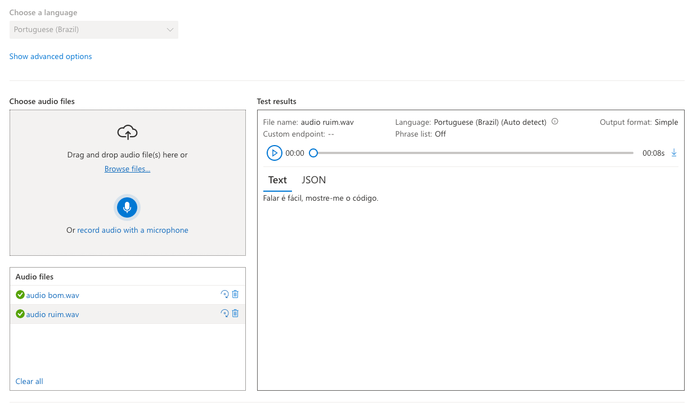|

#### O processo - Azure AI Language Studio

Há duas maneiras apresentadas para criar um serviço de linguagem:

- Criar um recurso Language.
- Criar um recurso Azure AI services.

No [Portal Azure](https://portal.azure.com) crie um **Language service** baseado nas informações do segundo link útil.

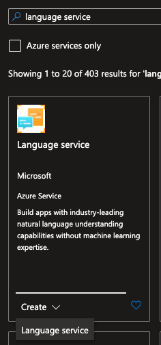

Em seguida acesse o [Azure AI Language Studio](https://language.cognitive.azure.com) e configure as informações na janela modal que aparece:

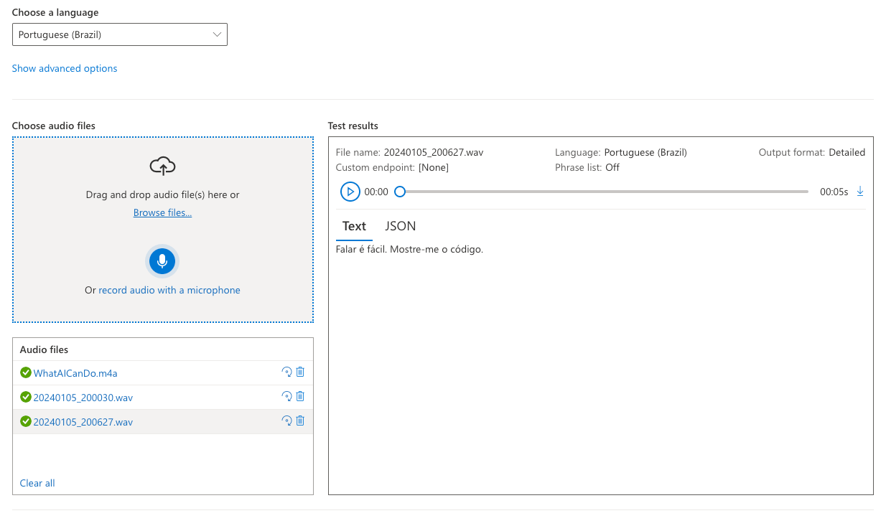

### Analyze sentiment and mine opinions

Imagine que a minha mãe está cuidado do meu cachorro chamado Chester. Ela aciona uma gravação e faz um relato sobre o travesso 🐶

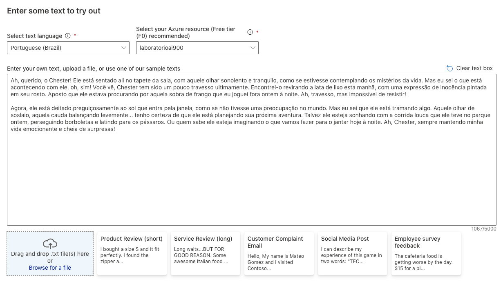

O resumo de análise de sentimento analisado pela IA:

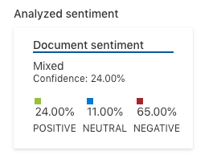

O target, o protagonista da conversa, o meu pet, foi detectado corretamente pela IA, observe:

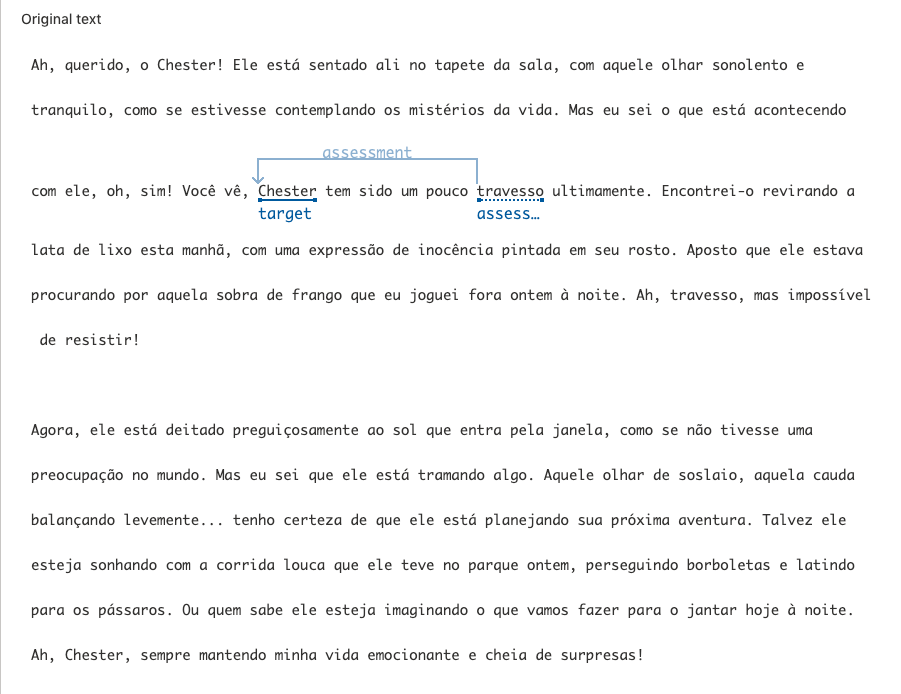

#### Sentenças

| Sentença 1 | Sentença 2 | Sentença 3 | Sentença 4 | Sentença 5 | Sentença 6 | Sentença 7 |
|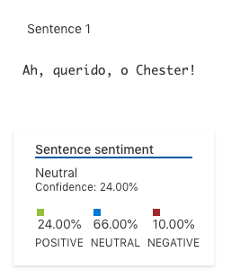|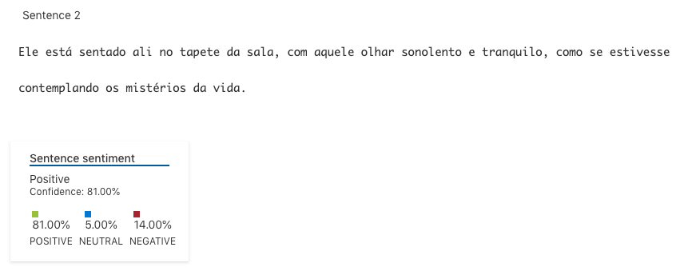|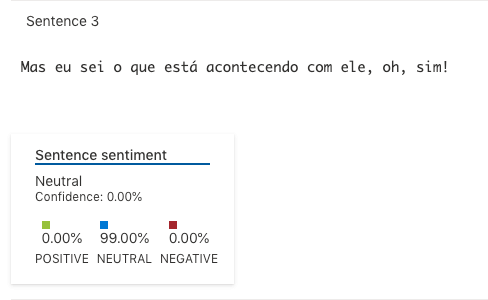|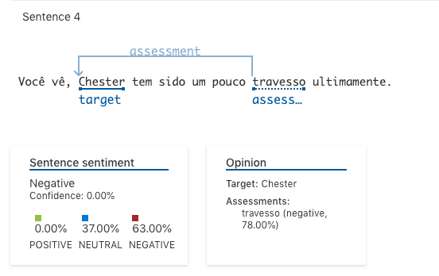|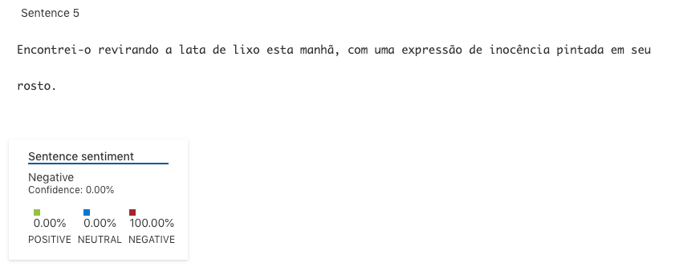|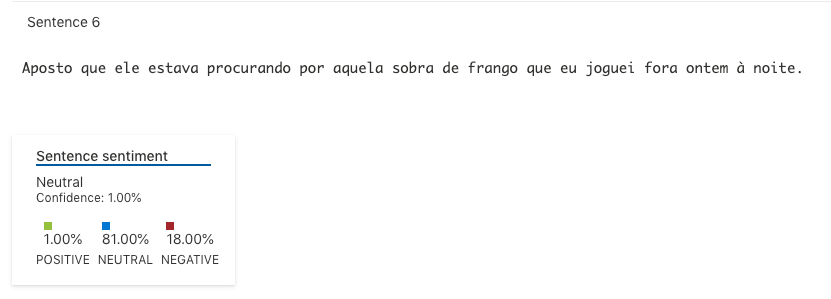|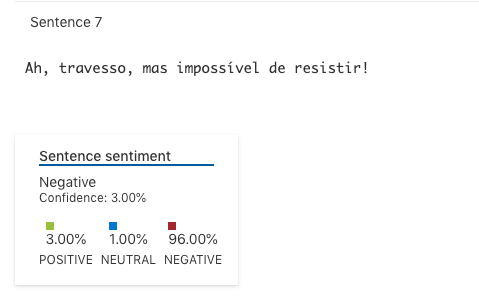|

| Sentença 8 | Sentença 9 | Sentença 10 | Sentença 11 | Sentença 12 | Sentença 13 | Sentença 14 |
|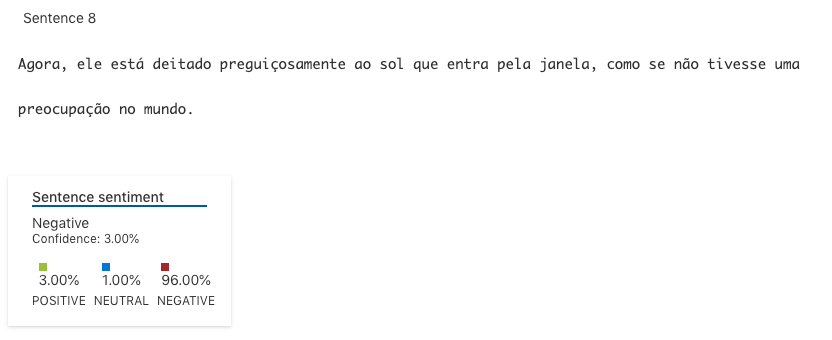|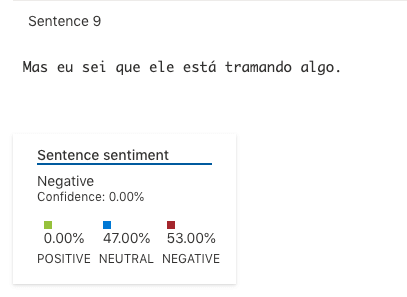|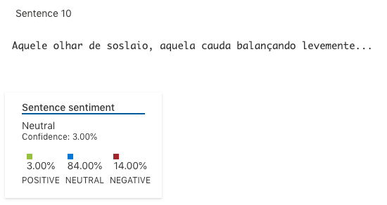|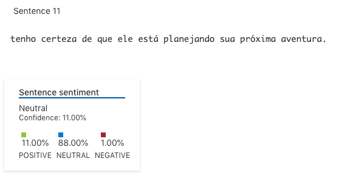|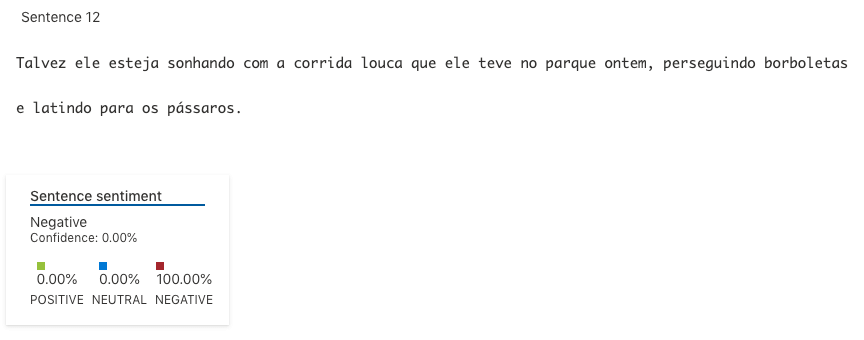|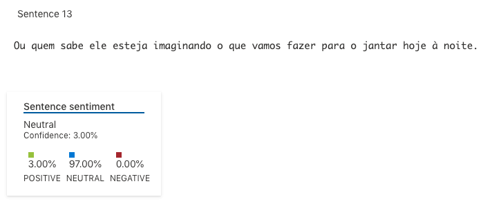||
